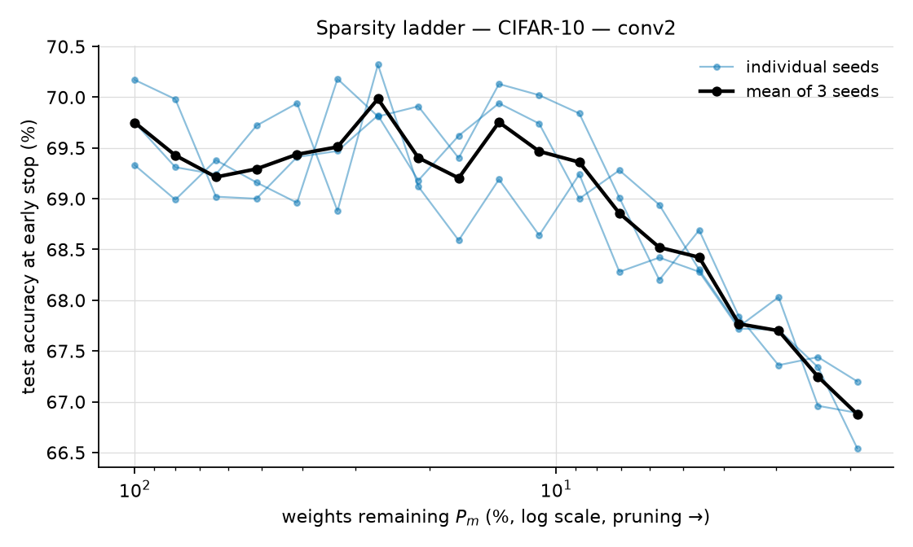
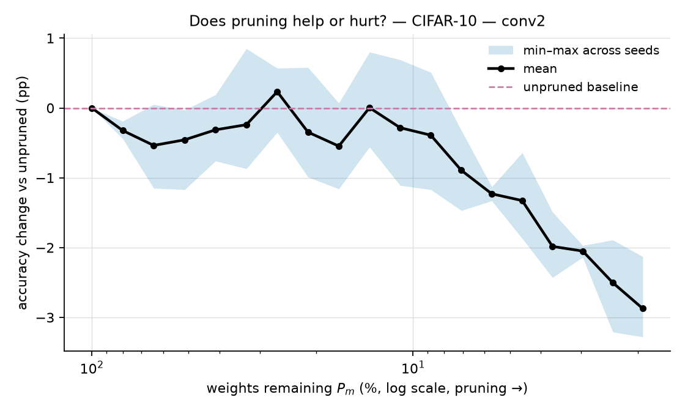
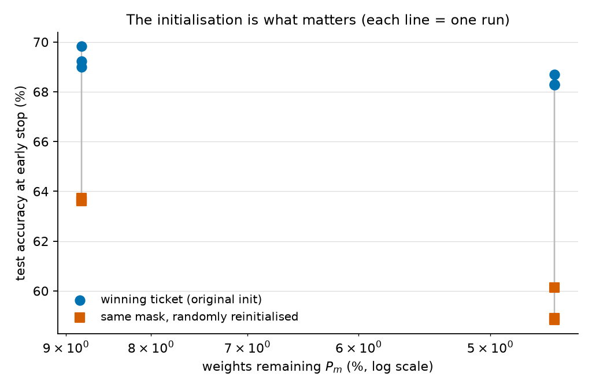

# Figures — CIFAR-10 — conv2

Generated from measured values only: no smoothing, no interpolation between
rungs, no trend fitting. Rendered on CPU from `metrics.json` — accelerator
quota buys training, not plotting.

- **3 seeds**, 19 pruning levels each
- device: `cuda`, 3.17 GPU-hours total

## Sparsity ladder (test accuracy at early stop, %)

| $P_m$ (%) | seed 0 | seed 1 | seed 2 | mean | Δ vs unpruned |
|---|---|---|---|---|---|
| 100.00 | 70.17 | 69.75 | 69.33 | 69.75 | +0.00 |
| 80.10 | 69.98 | 69.31 | 68.99 | 69.43 | -0.32 |
| 64.16 | 69.02 | 69.24 | 69.38 | 69.21 | -0.54 |
| 51.41 | 69.00 | 69.72 | 69.16 | 69.29 | -0.46 |
| 41.20 | 69.41 | 69.94 | 68.96 | 69.44 | -0.31 |
| 33.02 | 69.47 | 68.88 | 70.18 | 69.51 | -0.24 |
| 26.47 | 69.82 | 70.32 | 69.81 | 69.98 | +0.23 |
| 21.23 | 69.18 | 69.12 | 69.91 | 69.40 | -0.35 |
| 17.03 | 69.62 | 68.59 | 69.40 | 69.20 | -0.55 |
| 13.66 | 69.94 | 69.19 | 70.13 | 69.75 | +0.00 |
| 10.97 | 69.74 | 68.64 | 70.02 | 69.47 | -0.28 |
| 8.81 | 69.00 | 69.24 | 69.84 | 69.36 | -0.39 |
| 7.08 | 69.28 | 68.28 | 69.01 | 68.86 | -0.89 |
| 5.69 | 68.94 | 68.42 | 68.20 | 68.52 | -1.23 |
| 4.57 | 68.30 | 68.28 | 68.69 | 68.42 | -1.33 |
| 3.68 | 67.74 | 67.72 | 67.84 | 67.77 | -1.98 |
| 2.97 | 68.03 | 67.71 | 67.36 | 67.70 | -2.05 |
| 2.39 | 66.96 | 67.34 | 67.44 | 67.25 | -2.50 |
| 1.93 | 66.89 | 66.54 | 67.20 | 66.88 | -2.87 |

## How this evidence was produced

