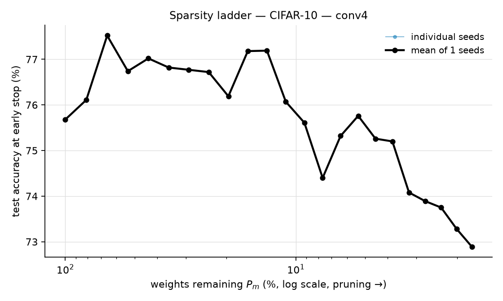
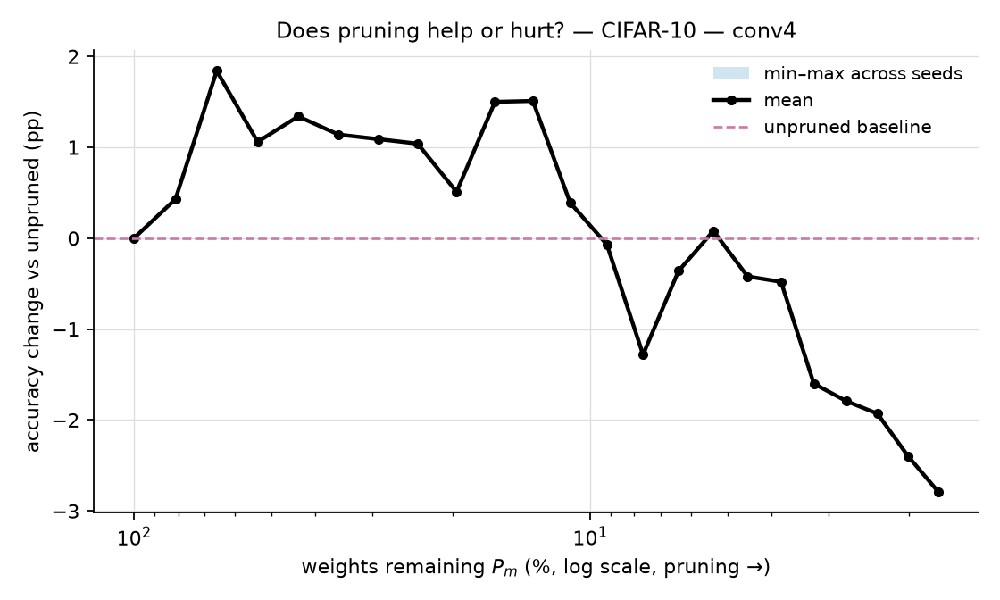
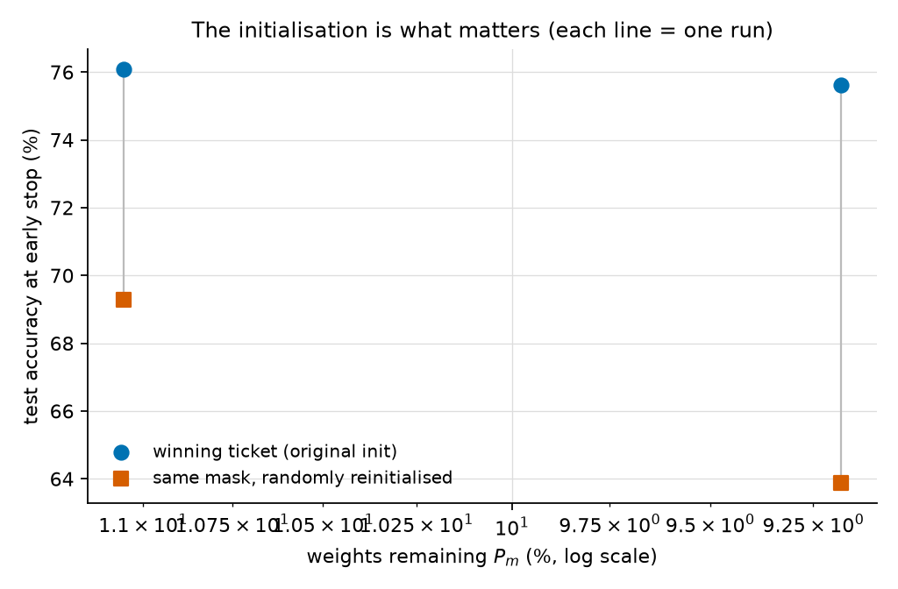

# Figures — CIFAR-10 — conv4

Generated from measured values only: no smoothing, no interpolation between
rungs, no trend fitting. Rendered on CPU from `metrics.json` — accelerator
quota buys training, not plotting.

- **1 seeds**, 23 pruning levels each
- device: `cuda`, 2.24 GPU-hours total

## Sparsity ladder (test accuracy at early stop, %)

| $P_m$ (%) | seed 1 | mean | Δ vs unpruned |
|---|---|---|---|
| 100.00 | 75.68 | 75.68 | +0.00 |
| 81.08 | 76.11 | 76.11 | +0.43 |
| 65.84 | 77.52 | 77.52 | +1.84 |
| 53.55 | 76.74 | 76.74 | +1.06 |
| 43.63 | 77.02 | 77.02 | +1.34 |
| 35.61 | 76.82 | 76.82 | +1.14 |
| 29.13 | 76.77 | 76.77 | +1.09 |
| 23.88 | 76.72 | 76.72 | +1.04 |
| 19.62 | 76.19 | 76.19 | +0.51 |
| 16.16 | 77.18 | 77.18 | +1.50 |
| 13.35 | 77.19 | 77.19 | +1.51 |
| 11.06 | 76.07 | 76.07 | +0.39 |
| 9.18 | 75.61 | 75.61 | -0.07 |
| 7.65 | 74.40 | 74.40 | -1.28 |
| 6.40 | 75.32 | 75.32 | -0.36 |
| 5.37 | 75.76 | 75.76 | +0.08 |
| 4.51 | 75.26 | 75.26 | -0.42 |
| 3.81 | 75.20 | 75.20 | -0.48 |
| 3.23 | 74.08 | 74.08 | -1.60 |
| 2.75 | 73.89 | 73.89 | -1.79 |
| 2.34 | 73.75 | 73.75 | -1.93 |
| 2.01 | 73.28 | 73.28 | -2.40 |
| 1.72 | 72.89 | 72.89 | -2.79 |

## How this evidence was produced

